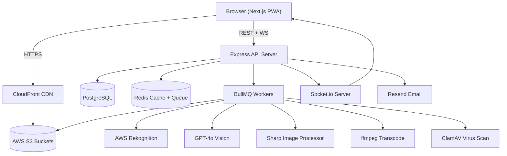
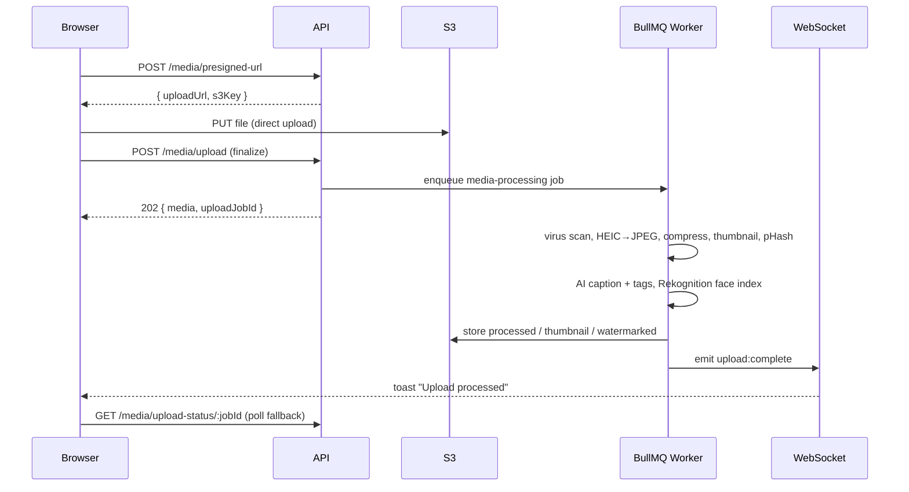

# Architecture — Event & Media Management Platform

A monorepo (npm workspaces) with three packages:

- `apps/web` — Next.js (App Router) frontend, React Query + Zustand, Tailwind, Socket.io client, PWA.
- `apps/api` — Express + Prisma API, JWT auth, BullMQ producers, Socket.io server.
- `packages/shared` — Zod schemas, enums and types shared by both apps.

## System diagram

## Request / upload flow

## Key flows

- **Auth** — JWT access token (short-lived) + refresh token (HttpOnly cookie). Google OAuth supported. RBAC via `ROLE_LEVEL` (VIEWER < CLUB_MEMBER < PHOTOGRAPHER < ADMIN).
- **Media pipeline** — direct-to-S3 presigned upload, then a BullMQ worker compresses (Sharp), generates thumbnails, computes a perceptual hash for dedup, extracts EXIF/GPS, runs AI captioning/tagging (OpenAI) and face indexing (Rekognition), transcodes video + poster (ffmpeg), and watermarks on download.
- **Real-time** — Socket.io pushes `notification:new`, `upload:complete`, and `upload:progress` events; the frontend shows toasts and invalidates React Query caches.
- **Search** — `/search` over media (aiTags GIN index, caption, event/album/uploader names), events and users.
- **Storage** — five private S3 buckets (original, processed, watermarked, avatars, selfies); browser access via presigned GET URLs or CloudFront when configured.

## Deployment topology

| Layer    | Local (dev)            | Production (suggested)              |
| -------- | ---------------------- | ----------------------------------- |
| Frontend | `next dev` :3000       | Vercel                              |
| API      | `tsx watch` :4000      | Railway / Render / EC2 (Docker)     |
| Worker   | `tsx watch` worker     | Railway background worker           |
| Postgres | Docker `postgres`      | Railway / Neon / RDS                |
| Redis    | Docker `redis`         | Railway / Upstash                   |
| Storage  | AWS S3 (or MinIO)      | AWS S3 + CloudFront                 |

See [`database-schema.md`](./database-schema.md) for the data model.
